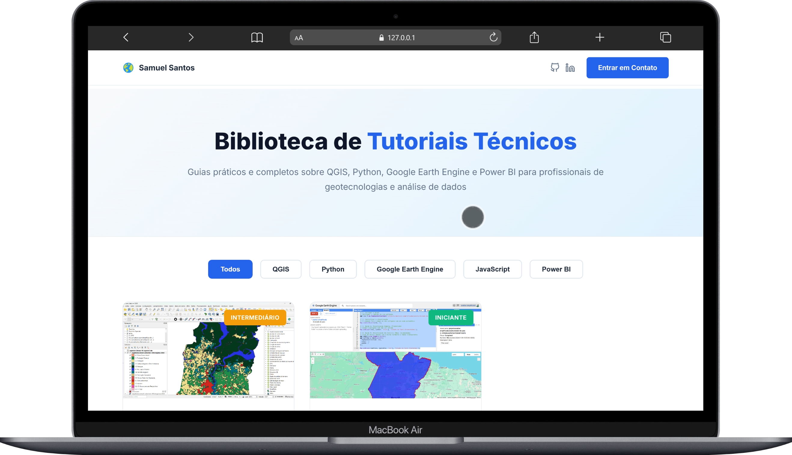

# Tutoriais | Samuel Santos

> Biblioteca de tutoriais técnicos sobre Geotecnologias, QGIS, Python, Google Earth Engine e análise de dados.

**Acesse:** [samuelsantos.site/tutoriais](https://samuelsantos.site/tutoriais)



---

## Sobre

Esta é a landing page centralizada de todos os meus tutoriais técnicos. Cada tutorial é um guia completo e prático, desenvolvido para profissionais e entusiastas de geotecnologias e análise de dados.

### Características

- **Filtros por Tecnologia** - QGIS, Python, GEE, JavaScript, Power BI  
- **Níveis de Dificuldade** - Iniciante, Intermediário, Avançado  
- **Design Responsivo** - Funciona perfeitamente em mobile e desktop  
- **Links Diretos** - Acesso rápido a cada tutorial completo  

---

## Estrutura do Repositório

```
tutoriais/
├── index.html          # Landing page principal
├── README.md           # Este arquivo
├── img/                # Thumbnails dos tutoriais
│   ├── automatizando-estilos-mapbiomas.png
│   └── primeiros-passos-gee.png
├── dados/              # Arquivos de suporte (futuramente)
└── .gitignore
```

---

## Design System

### Cores

```css
--primary-blue: #2563eb
--primary-dark: #1e40af
--dark-navy: #0f172a
--text-primary: #1e293b
--text-secondary: #64748b
--green-badge: #10b981  (Iniciante)
--yellow-badge: #f59e0b (Intermediário)
--orange-badge: #f97316 (Avançado)
```

### Tipografia

- **Fonte:** Inter (Google Fonts)
- **Hero Title:** 3rem, weight 800
- **Card Title:** 1.375rem, weight 600
- **Body:** 1rem, weight 400

---

## Links Úteis

- **Portfólio Principal:** [samuelsantos.site](https://samuelsantos.site)
- **GitHub:** [@samuel-c-santos](https://github.com/samuel-c-santos)
- **LinkedIn:** [samuel-c-santos](https://linkedin.com/in/samuel-c-santos)

---

## Licença

Este projeto está sob a licença MIT. Sinta-se à vontade para usar o código como referência para seus próprios projetos.

---

## Autor

**Samuel Santos**  
Especialista em Geotecnologias | Data Science | Geoprocessamento

- Email: samuelsantosambiental@gmail.com
- Portfolio: [samuelsantos.site](https://samuelsantos.site)
- GitHub: [@samuel-c-santos](https://github.com/samuel-c-santos)
- LinkedIn: [samuel-c-santos](https://linkedin.com/in/samuel-c-santos)
